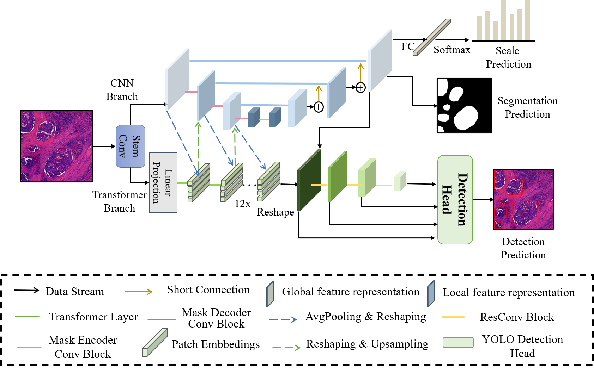

# MVI-DSNet: Automatic Detection of Microvascular Invasion in Hepatocellular Carcinoma Pathology Images

This project consists of models of our newly-proposed MVI-DSNet, which is a multi-task framework used for automatic detection of microvascular invasion in hepatocellular carcinoma pathology images.



## Implementation

- To train and test on your own dataset `custom_data.yaml`, run:

  ```bash
  python train.py --img 640 --batch 16 --epochs 100 --data ./configs/custom_data.yaml --cfg ./models/backbone/tcseg.yaml --weights '' --name my_custom_experiment
  ```

- To visualize the detection results, run:

  ```bash
  python detect.py --weights runs/train/my_custom_experiment/weights/best.pt --img 640 --conf 0.25 --source /path/to/images/ --name inference_results
  ```

- To use the detection platform and get statistic results on WSI level, run `MVI_detect/main.py` and select the WSI and pretrained models for detections, like:

  

## Experiment

We tested our dataset on multiple models and provided a list of baselines here.


## Data Availability

We will soon release our privately annotated, multi-labeled MVI dataset.

## Reference

- [WangRongsheng/BestYOLO: 🌟Change the world, it will become a better place. | 以科研和竞赛为导向的最好的YOLO实践框架!](https://github.com/WangRongsheng/BestYOLO)
- [https://github.com/ultralytics/yolov5/tree/v7.0](https://github.com/ultralytics/yolov5/tree/v7.0)

